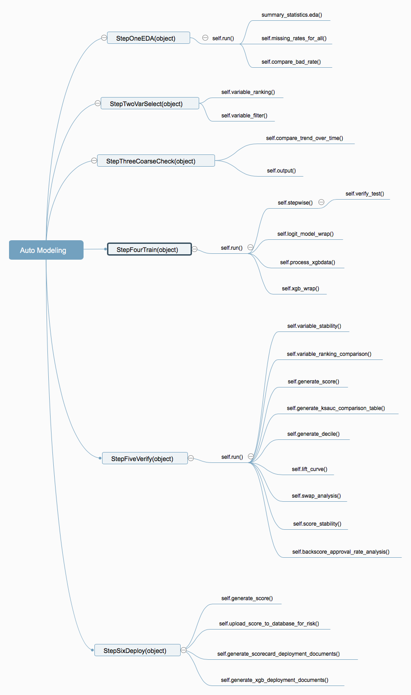

# Auto modeling
运行环境: Python 3.6

目前支持逻辑回归和XGBoost模型

更新时间： 2018-07-06





```
import os
import sys
import logging
import codecs
import argparse
from functools import reduce
from imp import reload
from datetime import datetime, timedelta

import numpy as np
import pandas as pd
from jinja2 import Template

import utils3.plotting as pl
import auto.auto_modeling as al
from utils3.data_io_utils import *
```


### 1. 数据准备
建模整理好的数据，缺失值已经处理好，通常包括每单申请的一些基本信息（如product_name, gamegroup等），Y和X数据。另外，index必须为区分申请的unique id。也必须包含columns:'sample_set', 用于区分train, test。

### 2. 参数准备
建模必选 Arguments:
- `all_x_y` (pd.DataFrame()): 建模整理好的数据，缺失值已经处理好，通常包括每单申请的一些基本信息
    （如product_name, gamegroup等），Y和X数据。另外，index必须为区分申请的unique id
- `var_dict` (pd.DataFrame()): 标准变量字典表，包含以下这些列：数据源，数据类型，指标类型，
指标英文，指标中文。
- `x_cols` (list): X变量名list
- `y_col` (str): column name of y
- `useless_vars` (list): 跑EDA summary时已知的无用变量名list，在exclusion reason里会被列为无用变量
- `exempt_vars` (list): 跑EDA summary时豁免变量名list，这些变量即使一开始被既定原因定为exclude，也会被
    保留，比如前一版本模型的变量
- `ranking_args_dict` (dict): key 是算法名称如['random_forest', 'svm', 'xgboost', 'IV', 'lasso']
    value是dict包含key值grid_search, param.如果没有赋值default值
- `ranking_methods` (list): ['random_forest', 'svm', 'xgboost', 'IV', 'lasso']


- `TRAIN_SET_NAME` (str): all_x_y中'sample_set'列取值为train set的具体取值
- `TEST_SET_NAME` (str): all_x_y中'sample_set'列取值为test set的具体取值, 如果为空则认为没有test set的需要
- `DATA_PATH` (str): 数据存储路径
- `RESULT_PATH` (str): 结果存储路径
- `SAVE_LABEL` (str): summary文档存储将用'%s_variables_summary.xlsx' % SAVE_LABEL
- `TIME_COL` (str): the column name indicating "time". e.g. 'apply_month', 'applicationdate'

建模可选 Keyword Arguments:
- `uniqvalue_cutoff（float`): 0-1之间，跑EDA summary表格时的缺失率和唯一值阈值设定。default=0.97
- `missingrate_cutoff` (float): 每个变量会计算按照时间维度的缺失率的std，这些std会被排序，排名前百分之几的会保留。defaut=0.75
- `badrate_cutoff` (float): 每个变量会计算按照时间维度的逾期率排序的std，这些std会被排序，排名前百分之几的会保留。defaut=0.75
- `xgbparams_selection_method` (list): ['XGBExp', 'XGBGrid', 'XGBRandom'],如果有xgboost模型的时候。分别对应经验参数，通过GridSearch调优的参数，通过RandomSearch调优的参数
- `xgb_params_range` (dict): xgboost gridsearch/randomsearch的搜索范围区间

```
    e.g. xgb_params_range = {
            'learning_rate': [0.05,0.1,0.2],
            'max_depth': [2, 3],
            'gamma': [0, 0.1],
            'min_child_weight':[1,3,10,20],
            # 'subsample': np.linspace(0.4, 0.7, 3),
            # 'colsample_bytree': np.linspace(0.4, 0.7, 3),
        }
```

- `xgb_param_experience` (dict): xgboost自定义经验参数

```
    e.g. xgb_param_experience = {
            'max_depth': 2,
            'min_samples_leaf ': int(len(self.X_train_xgboost)\*0.02),
             'eta': 0.1,
             'objective': 'binary:logistic',
             'subsample': 0.8,
             'colsample_bytree': 0.8,
             'gamma': 0,
             'silent': 0,
             'eval_metric':'auc'
        }
```

- `KEPT_LIMIT` (int): 变量选择最终希望保留的数量，即粗分箱可以承受的分箱变量数量。有的时候算法自动筛选后留下的变量依然很多，对于粗分箱来讲是很大的工作量，所以希望再减少一些。default=50

```
args_dict = {
    'random_forest': {
        'grid_search': False,
        'param': None
    },
    'xgboost': {
        'grid_search': False,
        'param': None
    }
}
methods = [
    'random_forest',
    'lasso',
    # 'xgboost'
]


params = {
'all_x_y': pd.DataFrame(),
'var_dict': pd.DataFrame(),
'x_cols': [],
'y_col': '',
'useless_vars': [],
'exempt_vars': [],
'ranking_args_dict': args_dict,
'ranking_methods': methods,
#
'DATA_PATH': '',
'RESULT_PATH': '',
'SAVE_LABEL': '',
'TIME_COL': '',
'TRAIN_SET_NAME': '',
'TEST_SET_NAME': '',
'OOT_SET_NAME': '',
# 可填
'NFOLD': 5,
'uniqvalue_cutoff': 0.97,
'missingrate_cutoff': 0.75,
'badrate_cutoff': 0.75,
'xgbparams_selection_method': xgbparams_selection_method,
'KEPT_LIMIT': 50,
'xgb_params_range': None,
'xgb_param_experience': None,
}

```
模型验证必选：
- `data_cat_dict` (dict): key为sample_set的名称。value为分箱好的数据，index为
    区分每条数据的unique identifier
- `xgboost_data_dict` (dict): key为sample_set的名称。value为xgboost要用的数据，
        index为区分每条数据的unique identifier。
- `var_dict` (pd.DataFrame()): 标准变量字典表，包含以下这些列：数据源，数据类型，指标类型，
指标英文，指标中文。
- `all_Y` (pd.DataFrame): 所有数据的(TRAIN, TEST, OOT etc)的Y，不同表现期的Y
    index为区分每条数据的unique identifier
- `y_cols` (list): all_Y中需要用于对比表现的Y的column name
- `union_var_list` (list): 所有需要对比的模型所选中的变量，只限逻辑回归模型
- `model_labels` (list): 需要对比的模型model_label名称
- `coarse_classing_rebin_spec` (dict): 粗分箱spec
- `liftcurve_name_map` (dict): 画lift curve的时候原始model_label转换成图中的
    显示名称，因为画图会将中文显示成方格，所以转换的值需全为英文。取名时请注意规范一致
    性和可读性和理解性，因为这个是会放到最终报告中的。key值为建模时各模型对应的model_label,
    value值为规范刻度和解释性较好的全英文正式模型名称


- `TRAIN_SET_NAME` (str): all_x_y中'sample_set'列取值为train set的具体取值
- `TEST_SET_NAME` (str): all_x_y中'sample_set'列取值为test set的具体取值, 如果为空则认为没有test set的需要
- `OOT_SET_NAME` (str): all_x_y中'sample_set'列取值为OOT set的具体取值, 如果为空则认为没有oot set
- `BACKSCORE_SET_NAME` (str): 'sample_set'列取值为backscore set的具体取值
- `DATA_PATH` (str): 数据存储路径
- `RESULT_PATH` (str): 结果存储路径
- `Y_BUILD_NAME` (str): 建模所用的Y的列明


模型验证可选：
- `backscore_has_perf` (list): list of applyid (unique identifier)用于区分
    backscore样本中有表现的样本。default=[]
- `base_model_score` (dict): 用于对比的老模型的分数，key为sample_set的名称。
    value为分数，index为区分每条数据的unique identifier。存储形式为pd.Series。
    如果需要与老模型，或者有老模型做为对比时，此为必选
- `BASE_MODEL_LABEL` (str): 用于对比的老模型或者benchmark模型正式的模型名称。如果需要
    与老模型，或者有老模型做为对比时，此为必选

```
params_verify = {
'data_cat_dict': {},
'xgboost_data_dict': {},
'var_dict': pd.DataFrame(),
'all_Y': pd.DataFrame(),
'y_cols': [],
'union_var_list': [],
'model_labels': [],
'coarse_classing_rebin_spec': {},
'liftcurve_name_map': {},
#
'TRAIN_SET_NAME': '',
'TEST_SET_NAME': '',
'OOT_SET_NAME': '',
'BACKSCORE_SET_NAME': '',
'DATA_PATH': '',
'RESULT_PATH': '',
'Y_BUILD_NAME': '',
#可选
'backscore_has_perf': [],
'base_model_score': {},
'BASE_MODEL_LABEL': ''
}

```


### 3. 执行EDA
第一步进行数据EDA，会产生EDA summary 表格，并根据每个月，或者所选中的时间维度对比缺失率是否稳定
  ，逾期率是否稳定。请确保输出的EDA summary表正确输出，并且已经根据EDA summary
    检查过数据异常并做了相关数据修正，同时相应的"exclusion_reason"那一列需要补充填写的都已
    填写完毕。所有"exclusion_reason"为空的指标都是在EDA阶段后保留的
```
step1_obj = al.StepOneEDA(params)
step1_obj.run()
```

本阶段输出文件：
  1. `RESULT_PATH`路径下『'%s_variables_summary.xlsx' % SAVE_LABEL)』文件。内容包括所有数据的EDA表格和相应的筛除原因等。
  2. `RESULT_PATH`路径下 `figure/badByTime`（按时间对比逾期率）和`figure/missingByTime`（按时间对比缺失率）文件夹。

### 4. 变量选择
根据不同算法给变量进行综合排序，进行变量筛选。选中变量做共线性排查

```
step2_obj = al.StepTwoVarSelect(params)
step2_obj.variable_ranking(bin20=True)
step2_obj.variable_filter(total_topn=50, source_topn=5, cluster_topn=5,
                          iv_threshold=0.3, corr_threshold=0.7,
                          vif_threshold=10)
```

本阶段输出文件：
  1. `RESULT_PATH`路径下『variable_filter.json』 包含每个步骤筛选涉及到的变量名list
  2. `RESULT_PATH`路径下『'%s_variables_summary.xlsx' % SAVE_LABEL)』文件。内容包括所有数据的EDA表格和相应的筛除原因等。较第一个EDA阶段输出的文件新增了变量选择筛除原因列，如：综合算法排序后保留，共线性筛查后保留
  3. `RESULT_PATH`路径下『overall_ranking.xlsx』包含各种算法排序排名
  4. `RESULT_PATH`路径下『colinearity_result.xlsx』包含每对变量的correlation和VIF
  5. `RESULT_PATH`路径下『woe_iv_df_auto_classing.xlsx』细分箱WOE、IV输出表格


### 5. 变量粗分箱 - 如果不粗分箱可跳过
检查变量逾期率的趋势，确保其可解释性。并按照时间维度生成排序对比表，确保在时间维度上排序性稳定

```
# 如果为第一次粗分箱
cols_filter = load_data_from_json(params['RESULT_PATH'], 'variable_filter.json')
auto_rebin_spec = load_data_from_pickle(params['DATA_PATH'], '建模细分箱10结果.pkl')['rebin_spec']
rebin_spec = {k:v for k,v in auto_rebin_spec.items() if k in cols_filter['ranking_kept']}
# 如果已经粗分箱过，需要在这个基础上调整
rebin_spec = load_data_from_pickle(params['DATA_PATH'], 'coarse_classing_rebin_spec.pkl')

ui_obj = pl.BinPlotAdjustUI(step2_obj.X_train[cols_filter['ranking_kept']],
                            step2_obj.y_train,
                            params['RESULT_PATH'],
                            params['DATA_PATH'],
                            rebin_spec, params['var_dict'])
ui_obj.main_ui(list(rebin_spec.keys()))
```

按照时间维度生成排序对比表，确保在时间维度上排序性稳定。如果有不稳定，可以返回上一步继续调整粗分箱。执行完输出文件为『变量粗分箱按时间维度对比逾期率排序性.xlsx』
```
step3_obj = al.StepThreeCoarseCheck(params)
step3_obj.compare_trend_over_time()
```

确认变量逾期率排序没有问题后。如果有无论怎么调整分箱，按时间维度排序性都不稳定决定放弃的的指标，
则将其作为输入放入以下 `trend_not_ok_exclude` 中
```
trend_not_ok_exclude = []
step3_obj.output(trend_not_ok_exclude)
```

本阶段输出文件：
  1. `DATA_PATH`路径下『'建模粗分箱.pkl'』内容为 `dict`包含Train， Test粗分箱分箱和woe转换数据
  2. `DATA_PATH`路径下『coarse_classing_rebin_spec.pkl』包含粗分箱边界信息
  3. `RESULT_PATH`路径下『变量粗分箱按时间维度对比逾期率排序性.xlsx』
  4. `RESULT_PATH`路径下更新『variable_filter.json』 包含每个步骤筛选涉及到的变量名list
  5. `RESULT_PATH`路径下 `figure/distNbad` 粗分箱分布&逾期率图
  6. `RESULT_PATH`路径下『woe_iv_df_coarse.xlsx』粗分箱WOE、IV输出表格


### 6. 建模

* 逻辑回归：在上一步选中的变量并完成粗分箱后，进行stepwise，确保train上的p-value显著且coef为正。如果test set的样本量大于5000，则将在test上也进行stepwise，确保train选中的变量在test上也是显著且coef为正的。自动建模版本存储名称为『AutoDefaultLogistic』
* XGBoost：在`step2_obj`步骤或者如果有调整粗分箱`step3_obj`步骤保留的字段，会保留原始值，并进行自动分箱后每箱转换成数值，以及分类变量转dummy的字段衍生。这些数据中加入2个随机数，一起用XGBoost算法进行重要性排序，排名超过排名最低的随机数的所有指标保留。根据`params`传入的参数决定如何调参。默认为经验值参数。根据所选调参方法选择最优参数并训练模型。存储的模型版本名称为『AutoDefaultXGBExp』、『AutoDefaultXGBGrid』或『AutoDefaultXGBRandom』

```
step4_obj = al.StepFourTrain(params)
# 任选以下几种
step4_obj.run(model_names=['logistic'])
step4_obj.run(model_names=['xgboost'])
step4_obj.run(model_names=['logistic', 'xgboost'])

```
如果需要针对自动建模结果进行调整可执行

```
# logistic
# 将新的选中原始字段名传入in_model
step4_obj.logit_model_wrap(model_label='RmCallLogistic', in_model=[])

# xgboost
step4_obj.selected = [] #新的选中原始字段名
step4_obj.process_xgbdata("RmCall") # 根据新的原始字段生成自动分箱变量和dummy变量
step4_obj.xgb_wrap("RmCall") # 建模&调参，输入名称如”版本2“等用于区分之前的存储结果。最好为有意义的英文名称便于画图。
```


本阶段输出文件：
  1. `DATA_PATH`路径下『xx模型结果.pkl』。存储内容为dict，包括模型obj，probility等
  2. `DATA_PATH`路径下『xgboost_xx.json』。内容为相应调参方法的最终选中参数
  3. `DATA_PATH`路径下『XGBoost输出数据和分箱明细.pkl』
  4. `RESULT_PATH`路径下『xx_score_card.xlsx』评分卡文件
  5. `RESULT_PATH`路径下『xx_train_coef.xlsx』训练样本系数
  6. `RESULT_PATH`路径下『xx_test_coef.xlsx』测试样本系数
  7. `RESULT_PATH`路径下『coarse_stepwise_log.log』记录stepwise每个步骤模型输出
  8. `RESULT_PATH`路径下更新『variable_filter.json』 包含每个步骤筛选涉及到的变量名list


### 7. 验证

```
step5_obj = al.StepFiveVerify(params_verify)
step5_obj.run()
```

`step5_obj.run()` 中包括以下步骤，如果需要可以单独拿出来使用

```
def run(self):
      self.variable_stability()
      self.variable_ranking_comparison()
      self.generate_scorecard_and_score()
      self.generate_ksauc_comparison_table()
      self.generate_decile()
      self.lift_curve()
      self.swap_analysis()
      self.score_stability()
      if len(self.backscore_has_perf) > 0:
          self.backscore_approval_rate_analysis()
```

本阶段输出文件：
  1. `RESULT_PATH/figure`路径下 `figure/AUC`图、 `figure/KS`图、『approval_rate_anaysis_xx.png』、
  『liftcurve_xx.png』图
  2. `DATA_PATH`路径下『xx模型分数.pkl』。存储内容为dict，包括各样本分数和变量对应分数
  3. `RESULT_PATH`路径下『变量xx逾期率对比xxVsxx.xlsx』对比2个样本相应y定义下的逾期率排序性
  4. `RESULT_PATH`路径下『对比模型SWAP_ANALYSIS.xlsx』新模型和基准模型的swap分析
  5. `RESULT_PATH`路径下『all_decile.xlsx』所有模型的10等分、runbook
  6. `RESULT_PATH`路径下『all_ksauc_perf_summary.xlsx』 新模型KS，AUC在不同样本上汇总表格
  7. `RESULT_PATH`路径下『all_model_score_psi.xlsx』所有新模型分数PSI
  8. `RESULT_PATH`路径下『all_ksauc_perf_summary.xlsx』 所有新模型变量PSI
  9. `RESULT_PATH`路径下『backscore通过率分析数据.xlsx』 为『approval_rate_anaysis_xx.png』图原始数据


### 8. 生成部署相关文件

1. 计算新样本的分数
比如需要计算最近2周的数据的分数。以下例子所用的数据是已经计算好分数的数据，只是为了demo展示.新数据集的分数会和其他数据集一起存到分数的pkl文件中

```
step6_obj.generate_score('AutoDefaultLogistic', data_cat_dict['BACKSCORE'], 'RECENT2WK')
```
2. 上传分数至数据库

```
step6_obj.upload_score_to_database_for_risk('AutoDefaultLogistic', liftcurve_name_map, 'MODELING_TRAIN')
```

3. 评分卡部署

```
production_name_map = {
    'province': 'province_v2',
    'rm_zx_unsec_os_amt': 'rm_zx_unsec_os_amt_v2'
}

step6_obj.generate_scorecard_deployment_documents(model_label='AutoDefaultLogistic',
                                                  live_abbr='v5fid15',
                                                  y_col='Y_fid15',
                                                  train_set_name='MODELING_TRAIN',
                                                  eda_file_name='demo_variables_summary.xlsx',
                                                  coarse_classing_rebin_spec=coarse_classing_rebin_spec,
                                                  production_modelName='xjdH5Score',
                                                  product_name='walletH5Credit',
                                                  liftcurve_name_map=liftcurve_name_map,
                                                  production_name_map=production_name_map)
```

4. XGBoost部署

```
step6_obj.generate_xgb_deployment_documents(model_label='AutoDefaultXGBExp',
                                            live_abbr='v5fid15', y_col='Y_fid15',
                                            train_set_name='MODELING_TRAIN',
                                            eda_file_name='demo_variables_summary.xlsx',
                                            var_dict=var_dict, model_label_version='AutoDefault',
                                            liftcurve_name_map=liftcurve_name_map,
                                            production_name_map=production_name_map)
```

### 9. 输出文件『variable_filter.json』说明
- eda_exclude_cols: EDA阶段剔除的字段
- alg_filter_selected: 综合排序算法排名保留的
- corr_exclude_cols: 共线性排名筛掉的
- ranking_kept: 综合排序筛掉共线性的字段后保留的。这些字段用于粗分箱
- coarsebin_kept_after_ranking: 如果粗分箱后，通过观察按时间排序逾期率不稳定需要剔除一些字段，则在这里记录剔除这些字段后保留的。
- stepwise_selected: 逻辑回归粗分箱字段stepwise后选中的字段
- xgboost_selected: xgboost选中的字段


### 10. demo样例

代码参照 [genie.demo.demo_auto_modeling.ipynb](http://git.jimubox.com/data-science/genie/blob/bdc88d95212a580264dff7d6925e95d348b805ca/demo/demo_auto_modeling.ipynb)

配套数据和输出结果参照 [Seafile/分析文件/modeling/demo](http://192.168.3.213:8000/#common/lib/b4d8000b-8abd-42c2-a5f9-7c7e247aad61/modeling/demo)
